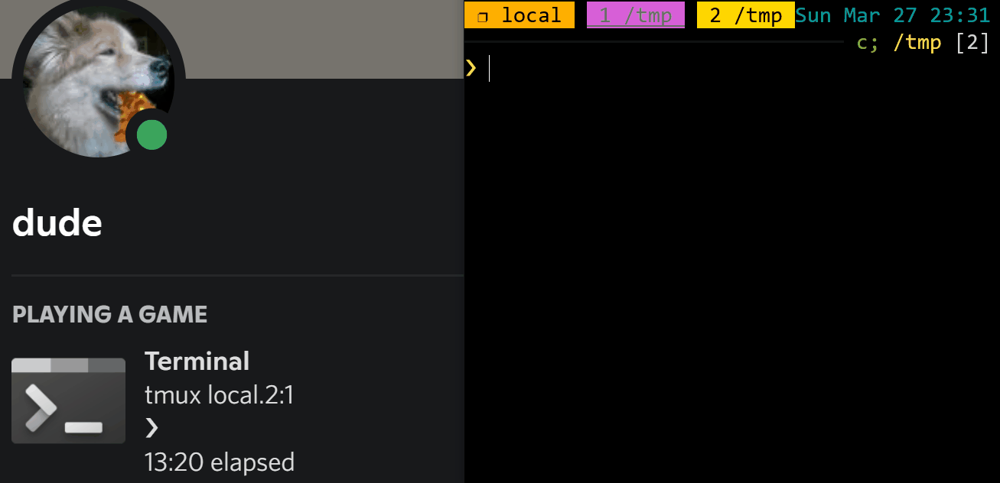

## rich-presence-cli

Manage your Discord Rich Presence from the command line over UDP.



## usage

Start a UDP proxy to the Discord IPC pipe:

```console
❯ make serve
go build -o ./bin/rich-presence.exe main.go
./bin/rich-presence.exe serve
2022/03/26 17:37:09 Listening on :1992
```

In another shell, send an update:

```console
❯ ./rich-presence.exe update --details "$(basename "$PWD")" --state browsing...
```

We can also form the JSON payloads ourselves:

```console
❯ echo '{"details":"wassup"}' > /dev/udp/$WINHOST/1992
```

In the above snippets, I'm running on Windows via WSL (hence the `.exe` suffix),
but it should work just fine on desktop Linux too.

### additional configuration

Check out the [`rich-presence.yml`](./rich-presence.yml) configuration file at
the root of this repo to see everything that's configurable. The search paths
for this file are as follows:

- `rich-presence.yml`
- `~/.rich-presence.yml`
- `~/.config/rich-presence/rich-presence.yml`

## rationale

Why a proxy? Because initial connection to the Discord IPC pipe is slow and the
UX is unfriendly. Plus, if running on WSL, you kind of need some sort of proxy
to interface with Windows named pipes (see [`WSL.md`](./WSL.md) for more notes).
